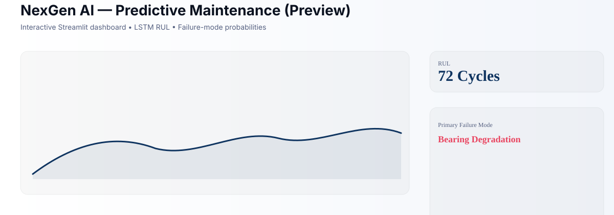
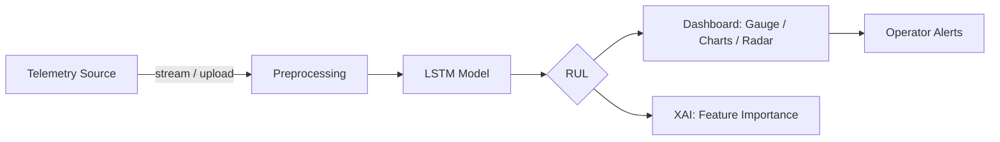

# NexGen Uptime — Predictive Maintenance


[](https://github.com)
[](https://www.python.org)
[](https://streamlit.io)
[](https://mermaid.js.org)

Lightweight Streamlit application demonstrating LSTM-based Remaining-Useful-Life
(RUL) prediction, failure-mode probability breakdowns, and interactive dashboards
for predictive maintenance experiments.

**Preview**

<picture>
	<source media="(prefers-color-scheme: dark)" srcset="assets/uptime_screenshot_dark.svg">
	
</picture>

## Table of Contents
- Features
- Quickstart
- Usage
- Architecture
- Files
- Notes & Next Steps

## Features
- Real-time simulation and CSV upload modes for telemetry
- LSTM-based RUL prediction with failure-mode probability breakdowns
- Interactive Plotly charts and XAI-style feature impact view
- Polished Streamlit UI with dark/light-friendly visuals

## Quickstart
1. Create and activate a virtual environment:

```powershell
python -m venv venv
venv\Scripts\activate
```

2. Install dependencies:

```powershell
pip install -r requirements.txt
```

3. Run the app locally:

```powershell
streamlit run app/app.py
```

Open `http://localhost:8501` in your browser (Streamlit opens it automatically).

## Usage
- Use the sidebar to switch between a simulated telemetry stream and uploading a
	historical CSV (the app expects the sequence length and feature count matching the trained model).
- Click `Step Cycle` to advance the simulation, or `Enable Auto-Telemetry` to animate.
- View the RUL gauge, telemetry series, vulnerability radar, and XAI feature impacts.

### Example flow (Mermaid)



## Files
- `app/app.py` — Streamlit application and UI logic
- `models/` — pretrained LSTM model (`lstm_model.h5` or `lstm_model_optimized.h5`) and `scaler.pkl`
- `notebooks/` — research Jupyter notebooks

## Dependencies
See `requirements.txt` for the minimal set used to run the app.

## Notes & Next Steps
- The app currently loads models from `models/` — ensure `lstm_model.h5` and `scaler.pkl` are present.
- For production usage, improve model loading checks, add input validation, and move heavy model
	artifacts to a model registry or remote storage.
- I included lightweight SVG placeholders for screenshots in `assets/`.

Would you like me to:
- generate a `requirements.txt` (done),
- add a Dockerfile, or
- capture real screenshots/GIFs from a running app? 

